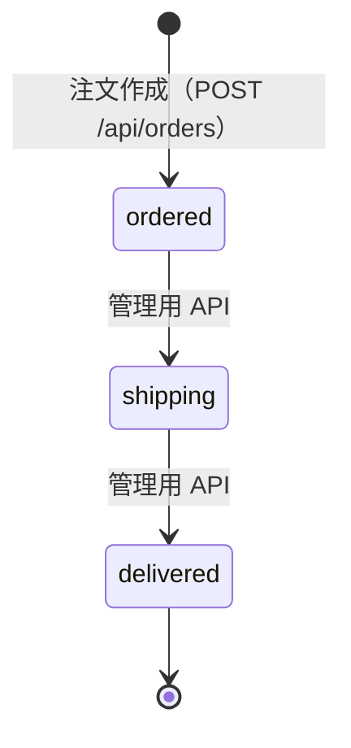

# API 仕様 — プロテイン比較・購入アプリ

- 作成日: 2026-08-28
- 入力: `docs/01-requirements/feature-list.md`（承認済み）、`docs/02-prototype/ui-spec.md`（確定版）、`docs/03-design/db-design.md`
- 位置づけ: 開発フロー第3段階（詳細設計）の成果物。AI 自走工程のため、技術選定は根拠を添えて本書で決定する。

## 1. 全体方針

### 1-1. 構成（決定事項）

**Next.js 16 App Router のルートハンドラ（`src/app/api/**/route.ts`）で REST API を実装する。**
ただし、**画面の初期表示に必要な読み取りは、HTTP を経由せずサーバーコンポーネントからサービス層を直接呼ぶ。**

| 層 | 置き場所 | 役割 |
|----|---------|------|
| リポジトリ層 | `src/server/repositories/` | Drizzle ORM による DB アクセスのみ。SQL の知識をここに閉じ込める |
| サービス層 | `src/server/services/` | 業務ロジック（おすすめ採点・価格計算・注文作成の検証）。**DB に依存しない純関数を最大限切り出す**（`/implement` の TDD 対象） |
| ルートハンドラ | `src/app/api/` | HTTP の入出力・バリデーション・エラー整形のみ。ロジックは持たない |
| 画面（サーバーコンポーネント） | `src/app/**/page.tsx` | サービス層を直接呼んで初期表示を描画する |

**この構成にした理由**: おすすめ診断と検索は URL クエリで状態を持つ仕様（`ui-spec.md` §2「診断条件は URL クエリに保持」・RV-02）なので、条件が変わるたびにページ遷移が起きる。サーバーコンポーネントで描画すれば、クライアントからの `fetch` を挟まずに済み、初期表示が速く、状態の二重管理も起きない。一方、注文作成のような「画面遷移を伴わない書き込み」と、お届け状況の更新（管理用）は HTTP エンドポイントが必要になる。

### 1-2. 各エンドポイントの利用形態

| # | メソッド | パス | 概要 | 対応機能 | UI での使われ方 |
|---|---------|------|------|---------|---------------|
| 1 | GET | `/api/products` | 商品一覧・検索 | F-03, F-04 | 一覧画面はサーバーコンポーネントで描画。エンドポイントは外部利用・テスト用に提供 |
| 2 | GET | `/api/products/{id}` | 商品詳細（ネット通販・実店舗の価格つき） | F-04, F-05 | 同上 |
| 3 | GET | `/api/recommendations` | 条件に合うおすすめ（順位・理由つき） | F-01, F-02 | 同上 |
| 4 | POST | `/api/orders` | 注文の作成（モック） | F-06 | **クライアントから `fetch` で呼ぶ** |
| 5 | GET | `/api/orders` | 注文履歴（お問い合わせ先・お届け状況つき） | F-07, F-08, F-10 | 履歴画面はサーバーコンポーネントで描画。エンドポイントも提供 |
| 6 | PATCH | `/api/admin/orders/{id}/delivery-status` | お届け状況の更新（管理用） | F-10 | **UI からは呼ばない**（`ui-spec.md` §5） |

> おすすめ診断の選択肢（目的・タイミング・こだわり）は要件で固定された列挙値のため、**マスタ取得 API は作らない。** アプリ定数として持つ（`db-design.md` §4）。

### 1-3. 認証・認可

| 対象 | 方針 |
|------|------|
| 一般利用者向けの全エンドポイント（#1〜#5） | **認証なし。** アカウント機能を作らないため（要件 Q-09、スコープ外 #3）。注文履歴も利用者で分けず全件返す（要件 Q-09 の決定どおり） |
| 管理用エンドポイント（#6） | **`Authorization: Bearer <ADMIN_API_TOKEN>`** による共有トークン認証。トークンは環境変数 `ADMIN_API_TOKEN` から読む。未設定の場合はエンドポイント自体を `503` で無効化する（誤って無防備に公開されるのを防ぐ） |

**個人情報は一切受け取らない・保存しない。** ダミーの支払い情報（カード番号・名義・有効期限）は**リクエストに含めない**設計にする。支払い方法の種別のみ送る（`ui-spec.md` §4・要件スコープ外 #2）。

### 1-4. 共通のレスポンス形式

成功時は対象データをそのまま返す。エラー時は必ず次の形式にする。

```json
{
  "error": {
    "code": "VALIDATION_ERROR",
    "message": "リクエストの内容が正しくありません。",
    "details": [
      { "field": "quantity", "message": "1〜5 の範囲で指定してください。" }
    ]
  }
}
```

| ステータス | `code` | 使う場面 |
|-----------|--------|---------|
| 400 | `VALIDATION_ERROR` | パラメータの型・範囲・列挙値が不正（`details` に項目ごとの理由） |
| 401 | `UNAUTHORIZED` | 管理用エンドポイントのトークンが無い・誤っている |
| 404 | `NOT_FOUND` | 商品・注文が存在しない |
| 409 | `CONFLICT` | 状態遷移が不正（お届け状況の逆行など） |
| 422 | `UNPROCESSABLE` | 形式は正しいが業務ルール違反（指定ショップがその商品を扱っていない など） |
| 500 | `INTERNAL_ERROR` | 想定外のエラー。詳細はレスポンスに出さずサーバーログに記録する |
| 503 | `SERVICE_UNAVAILABLE` | 管理用トークンが未設定でエンドポイントが無効 |

`message` は**利用者に見せられる日本語**にする（`ui-spec.md` の文言方針に合わせる）。技術的な詳細・スタックトレースは返さない。

### 1-5. Next.js 16 での実装上の注意（`/implement` への申し送り）

- 動的セグメントの `params` と、ページの `searchParams` は **Promise** になっている。`const { id } = await params;` のように `await` して使う（Next.js 15 以降の仕様変更）。
- 注文の作成・更新を行うルートハンドラは**キャッシュさせない**。読み取り系も在庫のような即時性はないが、注文履歴は毎回最新を返す必要があるため `export const dynamic = "force-dynamic"` を指定する。

## 2. GET `/api/products` — 商品一覧・検索（F-03, F-04）

### リクエスト（クエリパラメータ）

| 項目 | 型 | 必須 | 説明 |
|------|----|------|------|
| `q` | string | 任意 | 検索語。**商品名・ブランド名・味・種類に対する部分一致（大文字小文字を区別しない）**。`ui-spec.md` §3 の「部分一致」を実装。未指定・空文字なら全件 |

> 絞り込み（種類・価格帯など）のパラメータは**作らない**。要件のスコープ外 #5（絞り込み機能は複雑になるため見送り）。

### レスポンス 200

```json
{
  "items": [
    {
      "id": "0f1c...",
      "name": "マッスルグロウ ホエイ100",
      "brand": "筋トレ堂",
      "type": "whey",
      "typeLabel": "ホエイ",
      "flavor": "チョコレート風味",
      "weightG": 1000,
      "proteinContent": 75,
      "imageUrl": "/images/products/muscle-grow-choco.jpg",
      "lowestPrice": 3980,
      "pricePerGram": 3.98,
      "shippingNote": { "kind": "included", "fee": 500, "label": "内 送料 500円" }
    }
  ],
  "total": 12,
  "query": "ホエイ"
}
```

| 項目 | 型 | 説明 |
|------|----|------|
| `items[].lowestPrice` | number | **最安値（全チャネル・送料込み）**。定義は `ui-spec.md` §6 |
| `items[].pricePerGram` | number | 1g あたり価格（`lowestPrice / weightG`）。表示は小数第 1 位まで |
| `items[].shippingNote` | object | 送料の注記。`kind` は `included`（`内 送料 N円`）／ `free`（`送料無料`）／ `store`（`店頭価格・送料なし`）。`label` は表示用の文字列（`ui-spec.md` §6） |
| `total` | number | 件数。`ui-spec.md` §3 の件数表示に使う |
| `query` | string | 受け取った検索語。0 件時のメッセージで引用するため返す（`ui-spec.md` §3） |

**並び順**: 商品名の昇順（`name`, `flavor`）で安定させる。要件に並び替え機能はないため、実行ごとに順序が変わらないことだけを保証する。

## 3. GET `/api/products/{id}` — 商品詳細（F-04, F-05）

### リクエスト

| 項目 | 型 | 必須 | 説明 |
|------|----|------|------|
| `id`（パス） | string(uuid) | 必須 | 商品 ID。UUID として不正なら 400、存在しなければ 404 |

### レスポンス 200

```json
{
  "id": "0f1c...",
  "name": "マッスルグロウ ホエイ100",
  "brand": "筋トレ堂",
  "type": "whey",
  "typeLabel": "ホエイ",
  "flavor": "チョコレート風味",
  "weightG": 1000,
  "proteinContent": 75,
  "description": "定番のホエイプロテイン。溶けやすく、トレーニング後の一杯に。",
  "imageUrl": "/images/products/muscle-grow-choco.jpg",
  "preferences": ["lactose_free"],
  "preferenceLabels": ["乳糖不耐症対応（乳糖を抑えたもの）"],
  "lowestPrice": 3980,
  "pricePerGram": 3.98,
  "shippingNote": { "kind": "included", "fee": 500, "label": "内 送料 500円" },
  "onlineShops": [
    {
      "shopId": "a1...",
      "name": "プロテインマート",
      "itemPrice": 3480,
      "shippingFee": 500,
      "totalPrice": 3980,
      "pricePerGram": 3.98,
      "isCheapest": true,
      "breakdownLabel": "商品 3,480円 + 送料 500円"
    },
    {
      "shopId": "b2...",
      "name": "フィットEC",
      "itemPrice": 4180,
      "shippingFee": 0,
      "totalPrice": 4180,
      "pricePerGram": 4.18,
      "isCheapest": false,
      "breakdownLabel": "送料無料"
    }
  ],
  "stores": [
    {
      "storeId": "c3...",
      "name": "フィットネスショップ 池袋店",
      "price": 4280,
      "access": "JR池袋駅 東口から徒歩5分",
      "phone": "03-1111-2222",
      "businessHours": "10:00-21:00"
    }
  ]
}
```

仕様上の要点:

- **`onlineShops` は `totalPrice` の昇順で返す。** 先頭（最安）に `isCheapest: true` を立てる（`ui-spec.md` §3・RV-11）。同額の場合はショップ名の昇順で安定させる
- `breakdownLabel` は `ui-spec.md` §6 の内訳文字列。送料 0 円のときは `送料無料`、それ以外は `商品 N円 + 送料 M円`（**記号は半角**。RV-18②）
- `stores` は `price` の昇順。空配列のときは画面側で「取り扱っている実店舗のデータはありません」を表示する（`ui-spec.md` §3）
- 金額の桁区切り（`3,480円`）は表示整形の責務。API は数値と、`ui-spec.md` が文言まで定めているラベルのみ返す

## 4. GET `/api/recommendations` — おすすめ（F-01, F-02）

### リクエスト（クエリパラメータ）

| 項目 | 型 | 必須 | 説明 |
|------|----|------|------|
| `purpose` | enum(`muscle`/`diet`/`health`) | **必須** | 飲む目的 |
| `timing` | enum(`post_workout`/`morning`/`before_sleep`/`snack`) | **必須** | 飲みたいタイミング |
| `prefs` | string | 任意 | こだわりのカンマ区切り（`lactose_free,low_sugar` など）。未知の値が含まれていたら**無視せず 400 を返す** |

**不正値の扱い（RV-15）**: `purpose` / `timing` が不正、または `prefs` に未知の値が含まれる場合は `400 VALIDATION_ERROR` を返す。画面側はこれを受けて「リンクに含まれていた診断条件が無効だったため復元できませんでした」と通知する（`ui-spec.md` §2）。**黙って空の結果や全件を返してはいけない。**

### レスポンス 200

```json
{
  "criteria": {
    "purpose": "muscle",
    "purposeLabel": "筋肉をつけたい",
    "timing": "post_workout",
    "timingLabel": "運動後",
    "prefs": ["low_price"],
    "prefLabels": ["価格の安さ重視"]
  },
  "items": [
    {
      "rank": 1,
      "product": { "...": "GET /api/products/{id} と同じ商品サマリー（lowestPrice・pricePerGram・shippingNote を含む）" },
      "cheapestShopName": "パワーバリュー直販",
      "matches": ["筋肉をつけたい", "運動後", "価格の安さ重視"],
      "reason": "「筋肉をつけたい」にぴったり。運動後に素早く吸収されるホエイ。1gあたり約3.2円・総額9,480円で価格重視にマッチ。"
    }
  ],
  "total": 5
}
```

| 項目 | 型 | 説明 |
|------|----|------|
| `items[].rank` | number | 1 始まりの順位。カードの「おすすめ N 位」バッジに使う（`ui-spec.md` §2） |
| `items[].matches` | string[] | **一致した条件の表示ラベル配列。**「✓ 一致した条件」チップに使う（RV-09） |
| `items[].reason` | string | **1 行のおすすめ理由**（RV-09）。生成規則は §4-2 |
| `items[].cheapestShopName` | string | 最安値を出している販売元の名前。カードの「最安値: ショップ名」に使う（RV-18①） |
| `total` | number | 返した件数（最大 5） |

**スコアは返さない。** 利用者に見せる情報ではなく（`ui-spec.md` §2 は順位と理由の提示を求めている）、内部指標を公開すると仕様変更時の互換性が問題になるため。

### 4-1. おすすめ採点アルゴリズム（確定仕様）

**方式の決定: 外部 AI API（OpenAI / Gemini）やスクレイピングは使わず、サーバー側のローカルなルールベース計算とする。**

根拠（`ui-spec.md` §9 の申し送りに対する回答）:

1. **API キーが不要**で、誰でも `docker compose up` だけで同じ結果を再現できる（このプロジェクトは学習用サンプルであり、環境構築の障壁を増やすべきでない）
2. **決定的（同じ入力→同じ出力）なので単体テストが書ける。** `/implement` は TDD で進める規約があり、外部 API に依存すると採点ロジックのテストが成立しない
3. 外部 API は**レイテンシと課金**が発生し、「悩んでいるときにサッと使う」利用シーン（要件 Q-06）に合わない
4. スクレイピングは**利用規約・法的リスク**があり、要件のスコープ外 #7 で明示的に除外されている

> 将来 AI による説明文生成に差し替える場合は、サービス層の `scoreProducts()` を差し替えられる形に保つ（インターフェースを分離しておく）。ただし今回は実装しない（要件の範囲を超えるため）。

**採点の手順**（`ui-spec.md` §2 の採点方針を実装可能な粒度に落としたもの）:

```
入力: purpose, timing, prefs[]
対象: 全商品

手順1（ハードフィルタ）:
  prefs に lactose_free が含まれる場合、
  product_preferences に lactose_free を持たない商品を候補から除外する。
  （ui-spec.md §2「乳糖不耐症対応を選んだ場合、非対応商品はおすすめから除外する」）

手順2（加点）: 商品ごとに score = 0 から計算する
  a. purpose が product_purposes に含まれる      → score += 30
  b. timing  が product_timings  に含まれる      → score += 20
  c. prefs のうち low_price 以外の各値について、
     product_preferences に含まれる              → score += 15（値ごと）
  d. prefs に low_price が含まれる場合（価格そのもので評価する。RV-09）:
       economy       = clamp((5.2 - pricePerGram) * 8, 0, 20)
       affordability = clamp((4200 - lowestPrice) / 350, -8, 8)
       score += economy + affordability
  e. protein_content >= 85                       → score += 8

手順3（除外）: score <= 0 の商品を候補から外す

手順4（並べ替え）:
  score の降順。同点なら pricePerGram の昇順（安いほうを上に）。
  それも同じなら name, flavor の昇順（結果を安定させる）

手順5（件数）: 先頭 5 件を返し、rank を 1 から振る
```

- `pricePerGram`・`lowestPrice` は `db-design.md` §7 の定義（全チャネル・送料込みの最安値ベース）を使う
- **`low_price` をタグ一致（+15）で扱わない**のが RV-09 の要点。「価格の安さ重視」を選んだのに総額の高い商品が上位に来る不自然さを解消するため、実際の価格で加点し、総額が高い商品は `affordability` が負になって減点される
- 係数（5.2 / 8 / 4200 / 350）は、サンプルデータ（1g あたり約 3.2〜6.5 円、総額 2,980〜9,980 円）で「安い商品が上位に来る」ことを確認した値。**サンプルデータを増減させたら、この係数が妥当か再確認する**

### 4-2. 理由文と一致条件の生成規則（RV-09）

`matches`（チップ）には、一致した条件の表示ラベルを一致順（目的 → タイミング → こだわり）で入れる。

`reason` は以下の断片を生成順に集め、**先頭 3 つを「。」で連結し、末尾に「。」を付ける**。

| 条件 | 生成する断片 |
|------|-------------|
| 目的が一致 | `「{目的ラベル}」にぴったり` |
| タイミングが一致 | 下表の「種類×タイミングの補足」に該当があればその文、なければ `{タイミングラベル}の一杯に合う` |
| `lactose_free` が一致 | `乳糖を抑えているのでお腹にやさしい` |
| `vegan` が一致 | `100%植物性` |
| `low_sugar` が一致 | `低糖質` |
| `domestic` が一致 | `国内製造で安心` |
| `low_price` で `economy > 0` | `1gあたり約{X}円・総額{Y}円で価格重視にマッチ`（**総額を明記する**。RV-09） |
| `protein_content >= 85` | `タンパク質含有率{N}%の高含有` |

種類×タイミングの補足（該当する組み合わせのみ）:

| 種類 | タイミング | 文 |
|------|-----------|----|
| `whey` | `post_workout` | 運動後に素早く吸収されるホエイ |
| `wpi` | `post_workout` | 運動後の吸収が速い高純度WPI |
| `casein` | `before_sleep` | 就寝前にゆっくり長く吸収されるカゼイン |
| `soy` | `snack` | 腹持ちがよく間食にぴったりのソイ |
| `soy` | `morning` | 朝にうれしい植物性のソイ |

### レスポンス 200（0 件の場合）

`items: []`, `total: 0` を返す。画面側は「条件に合う商品が見つかりませんでした。こだわり条件を減らして試してみてください」と回復策を示す（`ui-spec.md` §2）。**エラーではないので 200 を返す。**

## 5. POST `/api/orders` — 注文の作成（F-06）

### リクエスト（JSON）

| 項目 | 型 | 必須 | 説明 |
|------|----|------|------|
| `productId` | string(uuid) | 必須 | 購入する商品 |
| `shopId` | string(uuid) | 必須 | 購入するネット通販ショップ |
| `quantity` | integer | 必須 | 数量。**1〜5**（`ui-spec.md` §4） |
| `paymentMethod` | enum(`credit_card`/`convenience_store`/`bank_transfer`) | 必須 | 支払い方法 |
| `idempotencyKey` | string(uuid) | 必須 | **二重送信防止キー**（RV-07）。購入画面を開いたときにクライアントで 1 つ生成し、同じ購入操作では同じ値を送る |

```json
{
  "productId": "0f1c...",
  "shopId": "a1...",
  "quantity": 2,
  "paymentMethod": "credit_card",
  "idempotencyKey": "5f0e8a12-..."
}
```

**カード番号・名義・有効期限は受け取らない。** ダミー値であってもサーバーに送らない（`ui-spec.md` §4 は「入力欄は readOnly のダミー」と定めており、値に意味がない）。要件スコープ外 #2（実在の支払い情報を扱わない）を、API の入力仕様として構造的に担保する。

### バリデーションと業務ルール（RV-07 の設計）

| # | チェック | 違反時 |
|---|---------|--------|
| 1 | `productId` / `shopId` が UUID 形式 | 400 `VALIDATION_ERROR` |
| 2 | `quantity` が 1〜5 の整数 | 400 `VALIDATION_ERROR` |
| 3 | `paymentMethod` が列挙値 | 400 `VALIDATION_ERROR` |
| 4 | `idempotencyKey` が UUID 形式 | 400 `VALIDATION_ERROR` |
| 5 | 商品が存在する | 404 `NOT_FOUND` |
| 6 | **指定ショップがその商品を取り扱っている**（`product_shop_offers` に組み合わせが存在する） | **422 `UNPROCESSABLE`**（メッセージ: 「指定された販売ショップではこの商品を購入できません。」） |
| 7 | 同じ `idempotencyKey` の注文が既にある | **201 ではなく 200** を返し、**既存の注文をそのまま返す**（新規作成しない） |

**#6 が RV-07 前半の対策。** デモでは不正な `?shop=` が黙って先頭ショップにフォールバックし、利用者が意図しないショップから購入できてしまっていた。本実装では**フォールバックせず明確に拒否する。** 画面側も、詳細ページのショップ行から遷移する導線のみを提供し、`shop` パラメータが商品と整合しない場合は購入画面を表示せずエラーを表示する。

**#7 が RV-07 後半の対策（二重送信防止）。** 完了画面からブラウザバックして再送信しても、同じ `idempotencyKey` なので注文は増えない。あわせてクライアント側でも送信中はボタンを無効化する（`ui-spec.md` に沿った UI 上の多重防御）。`idempotency_key` に UNIQUE 制約があるため、同時リクエストが競合しても DB レベルで 1 件に収束する（UNIQUE 違反を捕捉して既存注文を返す）。

**金額はサーバー側で決める。** クライアントから価格を送らせない（改ざんを防ぐ）。`item_price` は `product_shop_offers`、`shipping_fee` は `shops` から取得し、次の式で合計を算出して保存する。

```
total_price = item_price * quantity + shipping_fee
```

**送料は注文単位で 1 回**（数量では乗じない）。`questions.md` Q-01 で確定（toby 判断・2026-08-28）。
例: 単価 3,480円・送料 500円・数量 2 → 商品代金 6,960円 ＋ 送料 500円 ＝ **合計 7,460円**

### レスポンス 201（新規作成）／ 200（同一キーの再送）

```json
{
  "id": "9a7b...",
  "orderNumber": "ORD-0001",
  "productId": "0f1c...",
  "productName": "マッスルグロウ ホエイ100",
  "productFlavor": "チョコレート風味",
  "imageUrl": "/images/products/muscle-grow-choco.jpg",
  "shopName": "プロテインマート",
  "unitItemPrice": 3480,
  "shippingFee": 500,
  "quantity": 2,
  "totalPrice": 7460,
  "paymentMethod": "credit_card",
  "paymentMethodLabel": "クレジットカード",
  "deliveryStatus": "ordered",
  "deliveryStatusLabel": "注文済み",
  "orderedAt": "2026-08-28T04:12:00.000Z"
}
```

- `deliveryStatus` は必ず `ordered` で作成される（F-10・`ui-spec.md` §5「注文直後の状態は注文済み」）。完了画面の「お届け状況: 注文済み」に使う
- 完了画面が表示する注文番号・要約はこのレスポンスから描画する（`ui-spec.md` §4）

## 6. GET `/api/orders` — 注文履歴（F-07, F-08, F-10）

### リクエスト

パラメータなし。**注文を利用者で絞り込まない**（アカウントを作らないため。要件 Q-09 の決定）。

### レスポンス 200

```json
{
  "items": [
    {
      "id": "9a7b...",
      "orderNumber": "ORD-0001",
      "orderedAt": "2026-08-28T04:12:00.000Z",
      "deliveryStatus": "shipping",
      "deliveryStatusLabel": "お届け中",
      "productId": "0f1c...",
      "productName": "マッスルグロウ ホエイ100",
      "productFlavor": "チョコレート風味",
      "imageUrl": "/images/products/muscle-grow-choco.jpg",
      "shopName": "プロテインマート",
      "unitItemPrice": 3480,
      "shippingFee": 500,
      "quantity": 2,
      "totalPrice": 7460,
      "paymentMethodLabel": "クレジットカード",
      "contact": { "email": "support@protein-mart.example.com", "phone": "0120-111-222" }
    }
  ],
  "total": 1
}
```

- **並び順は `orderedAt` の降順**（新しい順）
- `contact` は F-08。`shops` から結合して返す。**実際の送信・発信は行わない**（スコープ外 #6）ため、表示用の値のみ
- `productId` を返すのは、注文カードから商品詳細へ遷移するため（RV-10）

## 7. PATCH `/api/admin/orders/{id}/delivery-status` — お届け状況の更新（F-10・管理用）

**このエンドポイントは UI から呼ばない。** `ui-spec.md` §5 が「利用者が自分で状態を進める画面は作らない」と定めているため、画面もボタンも作らない。デモにあった「🔧 デモ用: お届け状況を次に進める」リンクは本実装では作らない（`ui-spec.md` §8）。

### リクエスト

| 項目 | 型 | 必須 | 説明 |
|------|----|------|------|
| `Authorization`（ヘッダ） | string | 必須 | `Bearer <ADMIN_API_TOKEN>` |
| `id`（パス） | string(uuid) | 必須 | 注文 ID |
| `deliveryStatus`（本文） | enum(`shipping`/`delivered`) | 必須 | 次の状態。`ordered` への差し戻しは受け付けない |

### 状態遷移のルール



- **許可する遷移は `ordered → shipping` と `shipping → delivered` のみ。** 逆行（`delivered → shipping` など）と飛び越し（`ordered → delivered`）は **409 `CONFLICT`** で拒否する
- 同じ状態への更新（`shipping → shipping`）も 409 で拒否する（誤操作の検知を優先する）

### レスポンス

| ステータス | 内容 |
|-----------|------|
| 200 | 更新後の注文（`GET /api/orders` の要素と同じ形） |
| 401 | トークンが無い・誤っている |
| 404 | 注文が存在しない |
| 409 | 遷移が不正 |
| 503 | `ADMIN_API_TOKEN` が未設定（エンドポイント無効） |

## 8. 機能とエンドポイントの対応（トレーサビリティ）

| 機能ID | 機能名 | 対応エンドポイント／実装 |
|--------|--------|----------------------|
| F-01 | おすすめ条件の選択 | 選択肢はアプリ定数（API なし）。選んだ条件は `GET /api/recommendations` のクエリになる |
| F-02 | おすすめ商品の提示 | `GET /api/recommendations`（採点は §4-1、理由文は §4-2） |
| F-03 | 商品検索 | `GET /api/products?q=` |
| F-04 | 商品情報の一気見 | `GET /api/products/{id}`（`onlineShops` を含む） |
| F-05 | 実店舗情報の表示 | `GET /api/products/{id}` の `stores` |
| F-06 | 購入手続き | `POST /api/orders` |
| F-07 | 注文履歴の表示 | `GET /api/orders` |
| F-08 | お問い合わせ先の表示 | `GET /api/orders` の `contact` |
| F-09 | サンプル商品データの整備 | シードスクリプト（`db-design.md` §8）。API ではない |
| F-10 | お届け状況の表示 | `GET /api/orders` の `deliveryStatus`、更新は `PATCH /api/admin/orders/{id}/delivery-status` |

**すべての機能がエンドポイントまたは明示された実装手段でカバーされている。**

## 9. RV-07（デモの不具合として申し送られたガード）の対応まとめ

| デモでの問題 | 本実装での対策 | 実装箇所 |
|-------------|--------------|---------|
| 不正な `?shop=` が無言で先頭ショップにフォールバックし、意図しないショップから購入できた | 商品とショップの組み合わせを検証し、扱っていなければ **422 で拒否**。画面側も購入画面を出さずエラーを表示 | §5 バリデーション #6 |
| 注文完了後にブラウザバック → 再確定で重複注文が作れた | `idempotencyKey` による冪等化（UNIQUE 制約 + 既存注文を返す）。加えて送信中のボタン無効化 | §5 バリデーション #7 |
