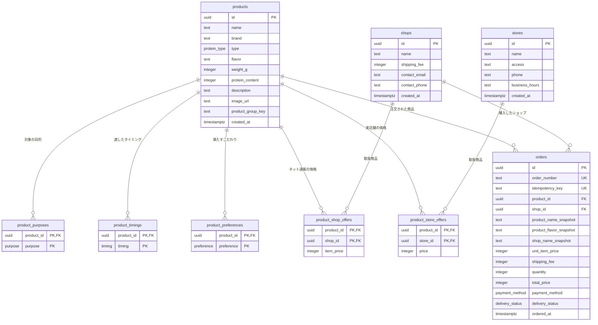

# DB 設計 — プロテイン比較・購入アプリ

- 作成日: 2026-08-28
- 入力: `docs/01-requirements/feature-list.md`（承認済み・再承認 2026-08-27）、`docs/02-prototype/ui-spec.md`（確定版）
- 位置づけ: 開発フロー第3段階（詳細設計）の成果物。AI 自走工程のため、技術選定は根拠を添えて本書で決定する。

## 1. 技術選定（決定事項）

| 項目 | 決定 | 根拠 |
|------|------|------|
| データベース | **PostgreSQL 16**（Docker Compose の `db` サービス） | 要件定義 Q-09 で「PostgreSQL のデータベースに接続している」前提が示され、`.env` にも `POSTGRES_USER` / `POSTGRES_DB` / `DATABASE_URL` が用意されている |
| DB アクセス | **Drizzle ORM + node-postgres（`pg`）** | ①ネイティブバイナリを持たない純 JS のため、`node:22-alpine` ＋ Next.js standalone 出力の構成でビルド設定を追加せずに動く（Prisma はクエリエンジンのバイナリ対応と standalone への同梱が必要で、インターンがつまずきやすい）②TypeScript でスキーマを定義でき、型が自動で付く ③発行される SQL が読める形なので学習効果がある |
| マイグレーション | **drizzle-kit**（`drizzle/` に SQL を生成し、`npm run db:migrate` で適用） | スキーマ変更が SQL ファイルとして残り、レビュー・巻き戻しができる |
| サンプルデータ投入 | **シードスクリプト**（`npm run db:seed`、冪等） | F-09（サンプル商品データの整備）を再現可能にする |
| 単体テスト | **Vitest**（既存）。DB に触るコードはリポジトリ層に隔離し、ロジック（採点・価格計算）は純関数として DB なしでテストする | `/implement` は TDD で進めるため、テストが DB 起動に依存しない構造にする |

### 1-1. `docker-compose.yml` への `db` サービス追加（必須の前提整備）

**現状の `docker-compose.yml` には `web` サービスしかなく、`db` サービスが存在しない。** 一方 `.env` は `POSTGRES_*` と `DATABASE_URL` を定義しており、コメントにも「Docker Compose では docker-compose.yml 側で db サービスを指す値が設定される」と書かれている。**`/implement` で以下を追加する。**

- `db` サービス: `postgres:16-alpine`、`env_file: .env`、名前付きボリュームで永続化、`healthcheck`（`pg_isready`）を設定
- `web` サービス: `depends_on: db`（`condition: service_healthy`）と、`db` を指す `DATABASE_URL` の環境変数を設定
- ポートはホストに公開しなくてよい（アプリからのみ接続）。開発中に外部ツールで覗きたい場合のみ `5432` を公開する

## 2. 設計方針

1. **表示価格は「送料込み」で統一する**（`ui-spec.md` §6）が、DB には **商品代金（`item_price`）と送料（`shipping_fee`）を分けて保存し、合計は計算で求める。**
   理由: `ui-spec.md` §6 が「商品 3,480円 + 送料 500円」という内訳表示を求めているため、内訳を復元できる形で持つ必要がある。合計だけを保存して送料を引く方式（デモの実装）は、送料が変わると内訳が崩れる。
2. **送料はショップごとの属性**として `shops` テーブルに持つ（`ui-spec.md` §6「送料はショップごとに決まる値として持つ（商品ごとではない）」）。
3. **実店舗の価格に送料は存在しない**（店頭渡し）。`ui-spec.md` §6 のとおり店舗価格はそのまま総額として扱う。
4. **注文は購入時点の情報をスナップショットする**（商品名・ショップ名・単価・送料）。商品価格が後から変わっても注文履歴の金額が変わらないようにする。あわせて `product_id` / `shop_id` の外部キーも残し、商品詳細への遷移（RV-10）とお問い合わせ先の表示（F-08）に使う。
5. **アカウントは作らない**（F-07・要件 Q-09）。注文は利用者で分けず、「このアプリで注文したもの」として全件を新しい順に表示する。個人情報を一切保存しないため、これによる情報漏えいは発生しない（支払い情報はダミーで、DB に保存しない）。
6. **列挙値は PostgreSQL の ENUM 型**で定義する。目的・タイミング・こだわり・プロテイン種類・支払い方法・お届け状況は要件で固定されているため、文字列の自由入力を許さずスキーマで縛る。

### 2-1. 同名商品の味違いの扱い（`ui-spec.md` §9 の申し送り）

**決定: 味（フレーバー）ごとに 1 行の `products` レコードとして扱い、グルーピングはしない。**

- 根拠: ①`ui-spec.md` §3 の一覧カード・商品詳細が「商品名 + フレーバー」を並べて 1 商品として見せる形でレビュー合意されている ②味によってタンパク質含有率や価格が異なるため、1 レコードにまとめると価格・成分をどちらの味の値にするか決められない
- 将来まとめたくなった場合に備え、`products.product_group_key`（NULL 許容）を用意しておく。同じ商品群に同じ値を入れておけば、後から「味を選ぶ UI」に発展させられる。**今回の実装ではこの列を表示にも検索にも使わない**（要件の範囲を超えないため）

### 2-2. お届け状況の更新方法（F-10・`ui-spec.md` §5 の申し送り）

- 状態は `orders.delivery_status`（`ordered` / `shipping` / `delivered`）に持つ。注文作成時は必ず `ordered`。
- **利用者が自分で状態を進める画面・API は作らない**（`ui-spec.md` §5 の明示指定）。
- 更新は**管理用エンドポイント**（`PATCH /api/admin/orders/{id}/delivery-status`）のみで行い、環境変数のトークンで保護する（詳細は `api-spec.md` §6）。管理画面は要件外なので作らない。
- 遷移は `ordered → shipping → delivered` の一方向のみ許可し、逆行・飛び越しはアプリケーション層で拒否する。
- 状態遷移の履歴テーブルは作らない（要件は「現在の状況を表示できること」まで。監査要件がないため最小構成を選ぶ）。

## 3. ER 図

## 4. ENUM 型の定義

| ENUM 名 | 値 | 表示ラベル | 対応機能 |
|---------|----|-----------|---------|
| `purpose` | `muscle` / `diet` / `health` | 筋肉をつけたい ／ ダイエット・減量 ／ 健康維持・栄養補給 | F-01 |
| `timing` | `post_workout` / `morning` / `before_sleep` / `snack` | 運動後 ／ 朝食時・朝 ／ 就寝前 ／ 間食・おやつ代わり | F-01 |
| `preference` | `lactose_free` / `vegan` / `low_sugar` / `domestic` / `low_price` | 乳糖不耐症対応（乳糖を抑えたもの） ／ 植物性（ヴィーガン対応） ／ 低糖質 ／ 国内製造 ／ 価格の安さ重視 | F-01 |
| `protein_type` | `whey` / `wpi` / `casein` / `soy` / `mix` | ホエイ ／ WPI（ホエイアイソレート） ／ カゼイン ／ ソイ ／ ミックス | F-04, 用語説明 |
| `payment_method` | `credit_card` / `convenience_store` / `bank_transfer` | クレジットカード ／ コンビニ払い ／ 銀行振込 | F-06 |
| `delivery_status` | `ordered` / `shipping` / `delivered` | 注文済み ／ お届け中 ／ お届け済み | F-10 |

表示ラベルは DB に持たず、アプリケーション側の定数として持つ（`ui-spec.md` の文言をそのまま使う）。

## 5. テーブル定義

### 5-1. `products` — 商品マスタ（F-09, F-04, F-03）

| カラム | 型 | 制約 | 説明 |
|--------|----|------|------|
| `id` | `uuid` | PK, default `gen_random_uuid()` | 商品 ID |
| `name` | `text` | NOT NULL | 商品名（例: マッスルグロウ ホエイ100） |
| `brand` | `text` | NOT NULL | ブランド名。検索対象（F-03） |
| `type` | `protein_type` | NOT NULL | プロテインの種類。用語説明ページと対応（RV-04） |
| `flavor` | `text` | NOT NULL | 味・風味（例: チョコレート風味） |
| `weight_g` | `integer` | NOT NULL, CHECK > 0 | 内容量（g）。1g あたり価格の分母 |
| `protein_content` | `integer` | NOT NULL, CHECK 0〜100 | タンパク質含有率（%） |
| `description` | `text` | NOT NULL | 商品説明（商品詳細に表示） |
| `image_url` | `text` | NOT NULL | 商品画像の URL。**デモの絵文字プレースホルダーを実画像に置き換える**（RV-08②） |
| `product_group_key` | `text` | NULL 許容 | 味違いをまとめる将来用のキー（§2-1）。今回は未使用 |
| `created_at` | `timestamptz` | NOT NULL, default `now()` | 作成日時 |

インデックス:
- `idx_products_name_brand_search`: `GIN (to_tsvector('simple', name || ' ' || brand || ' ' || flavor))` ではなく、**部分一致（`ILIKE '%q%'`）を要件とするため `pg_trgm` 拡張 + `GIN (name gin_trgm_ops)` / `GIN (brand gin_trgm_ops)`** を張る。`ui-spec.md` §3 が「部分一致」を指定しており、前方一致前提の B-tree では効かないため。
  - データ件数が 10〜20 件（F-09）と小さいため、`pg_trgm` が使えない環境ではインデックスなしの `ILIKE` でも実用上問題ない。**必須ではなく推奨**として扱う。

### 5-2. `product_purposes` / `product_timings` / `product_preferences` — 商品の条件タグ（F-01, F-02）

3 テーブルとも同じ構造。おすすめ診断の採点でどの条件に一致するかを判定するために使う。

| カラム | 型 | 制約 | 説明 |
|--------|----|------|------|
| `product_id` | `uuid` | PK（複合）, FK → `products.id` ON DELETE CASCADE | 商品 ID |
| `purpose` / `timing` / `preference` | 対応する ENUM | PK（複合） | 条件の値 |

インデックス: 複合 PK が `(product_id, 値)` なので商品からの引きは効く。条件から商品を引く用途もあるため `idx_<table>_value`（値の単独インデックス）を張る。

> **配列型（`purpose[]`）ではなく結合テーブルにした理由**: 「この条件に合う商品を引く」クエリが SQL として素直に書け、外部キー制約で不正値を防げるため。インターンが SQL の結合を学べる形も意図している。

### 5-3. `shops` — ネット通販ショップ（F-04, F-06, F-08）

| カラム | 型 | 制約 | 説明 |
|--------|----|------|------|
| `id` | `uuid` | PK, default `gen_random_uuid()` | ショップ ID |
| `name` | `text` | NOT NULL | ショップ名 |
| `shipping_fee` | `integer` | NOT NULL, CHECK >= 0 | **送料（円）。ショップごとに決まる**（`ui-spec.md` §6）。`0` は送料無料 |
| `contact_email` | `text` | NOT NULL | お問い合わせ先メール（F-08） |
| `contact_phone` | `text` | NOT NULL | お問い合わせ先電話（F-08） |
| `created_at` | `timestamptz` | NOT NULL, default `now()` | 作成日時 |

### 5-4. `stores` — 実店舗（F-05）

| カラム | 型 | 制約 | 説明 |
|--------|----|------|------|
| `id` | `uuid` | PK, default `gen_random_uuid()` | 店舗 ID |
| `name` | `text` | NOT NULL | 店舗名 |
| `access` | `text` | NOT NULL | アクセス方法（例: JR池袋駅 東口から徒歩5分） |
| `phone` | `text` | NOT NULL | 電話番号 |
| `business_hours` | `text` | NOT NULL | 営業時間（例: 10:00-21:00） |
| `created_at` | `timestamptz` | NOT NULL, default `now()` | 作成日時 |

> 実店舗に送料の列は持たない。店頭渡しのため送料の概念が存在しない（`ui-spec.md` §6）。

### 5-5. `product_shop_offers` — 商品×ネット通販の価格（F-04, F-06）

| カラム | 型 | 制約 | 説明 |
|--------|----|------|------|
| `product_id` | `uuid` | PK（複合）, FK → `products.id` ON DELETE CASCADE | 商品 ID |
| `shop_id` | `uuid` | PK（複合）, FK → `shops.id` ON DELETE CASCADE | ショップ ID |
| `item_price` | `integer` | NOT NULL, CHECK > 0 | **商品代金（円・送料を含まない）** |

- 表示する総額 = `item_price + shops.shipping_fee`（`ui-spec.md` §6）
- インデックス: `idx_offers_shop_product` に `(shop_id, product_id)` を追加（ショップ起点の引き用）

### 5-6. `product_store_offers` — 商品×実店舗の価格（F-05）

| カラム | 型 | 制約 | 説明 |
|--------|----|------|------|
| `product_id` | `uuid` | PK（複合）, FK → `products.id` ON DELETE CASCADE | 商品 ID |
| `store_id` | `uuid` | PK（複合）, FK → `stores.id` ON DELETE CASCADE | 店舗 ID |
| `price` | `integer` | NOT NULL, CHECK > 0 | 店頭価格（円・送料なし＝これが総額） |

### 5-7. `orders` — 注文（F-06, F-07, F-08, F-10）

| カラム | 型 | 制約 | 説明 |
|--------|----|------|------|
| `id` | `uuid` | PK, default `gen_random_uuid()` | 注文 ID |
| `order_number` | `text` | NOT NULL, UNIQUE | 表示用の注文番号（例: `ORD-0001`）。連番は採番シーケンスから生成 |
| `idempotency_key` | `text` | NOT NULL, UNIQUE | **二重送信防止用のキー**（RV-07）。同じキーの再送は新規作成せず既存注文を返す |
| `product_id` | `uuid` | NOT NULL, FK → `products.id` ON DELETE RESTRICT | 商品詳細への遷移に使う（RV-10） |
| `shop_id` | `uuid` | NOT NULL, FK → `shops.id` ON DELETE RESTRICT | お問い合わせ先の取得に使う（F-08） |
| `product_name_snapshot` | `text` | NOT NULL | 購入時点の商品名 |
| `product_flavor_snapshot` | `text` | NOT NULL | 購入時点の味 |
| `shop_name_snapshot` | `text` | NOT NULL | 購入時点のショップ名 |
| `unit_item_price` | `integer` | NOT NULL, CHECK > 0 | 購入時点の商品単価（送料を含まない） |
| `shipping_fee` | `integer` | NOT NULL, CHECK >= 0 | 購入時点の送料。**注文単位で 1 回分**（数量では乗じない。Q-01 で確定） |
| `quantity` | `integer` | NOT NULL, CHECK 1〜5 | 数量。`ui-spec.md` §4 の「数量 1〜5」を CHECK 制約で守る |
| `total_price` | `integer` | NOT NULL, CHECK > 0 | 合計金額（円）。`unit_item_price * quantity + shipping_fee` |
| `payment_method` | `payment_method` | NOT NULL | 支払い方法 |
| `delivery_status` | `delivery_status` | NOT NULL, default `'ordered'` | お届け状況（F-10） |
| `ordered_at` | `timestamptz` | NOT NULL, default `now()` | 注文日時 |

インデックス:
- `idx_orders_ordered_at`: `(ordered_at DESC)` — 注文履歴は新しい順に表示するため
- `uq_orders_idempotency_key`: UNIQUE（二重送信防止の要）
- `uq_orders_order_number`: UNIQUE

**支払い情報（カード番号・名義・有効期限）は一切保存しない。** ダミー値であっても DB に残さない（要件のスコープ外 #2、`ui-spec.md` §4）。支払い方法の種別のみ保存する。

**送料の計上について（`questions.md` Q-01 で確定）**:

- **決定: 送料は注文単位で 1 回。** `total_price = unit_item_price * quantity + shipping_fee`
- したがって `orders.shipping_fee` は**その注文にかかった送料の総額**（数量に関わらず 1 回分）を意味する
- 例: 商品単価 3,480円・送料 500円・数量 2 → 商品代金 6,960円 ＋ 送料 500円 ＝ **合計 7,460円**
- 根拠: 実際のネット通販の一般的な扱いに合わせるため（toby 判断・2026-08-28、`questions.md` Q-01 選択肢 A）。デモが送料 × 数量で計算していたのは、価格に送料を含めて保存していた実装上の都合によるもので、意図した業務ルールではなかった
- `ui-spec.md` §6 の「商品代金／送料／合計」の 3 行内訳という**表示構成は変わらない**

### 5-8. 注文番号の採番

- PostgreSQL のシーケンス `orders_number_seq` を作成し、`'ORD-' || LPAD(nextval('orders_number_seq')::text, 4, '0')` で生成する。
- アプリ側でカウントして採番すると同時実行で衝突するため、シーケンスを使う。UNIQUE 制約が最終的な防波堤になる。

## 6. 機能とテーブルの対応（トレーサビリティ）

| 機能ID | 機能名 | 主に使うテーブル |
|--------|--------|----------------|
| F-01 | おすすめ条件の選択 | （選択肢は ENUM 定義とアプリ定数。DB 参照なし） |
| F-02 | おすすめ商品の提示 | `products`, `product_purposes`, `product_timings`, `product_preferences`, `product_shop_offers`, `product_store_offers`, `shops`, `stores` |
| F-03 | 商品検索 | `products`（`name` / `brand` の部分一致） |
| F-04 | 商品情報の一気見 | `products`, `product_shop_offers`, `shops`, `product_store_offers`, `stores` |
| F-05 | 実店舗情報の表示 | `stores`, `product_store_offers` |
| F-06 | 購入手続き | `orders`（作成）, `products`, `shops`, `product_shop_offers`（価格の検証） |
| F-07 | 注文履歴の表示 | `orders` |
| F-08 | お問い合わせ先の表示 | `orders` → `shops`（`contact_email`, `contact_phone`） |
| F-09 | サンプル商品データの整備 | 全テーブル（シードスクリプト） |
| F-10 | お届け状況の表示 | `orders.delivery_status` |

**すべての機能がいずれかのテーブル、または「DB 不要」の明示でカバーされている。**

## 7. 導出値の計算ルール（アプリケーション層）

DB には持たず、参照時に計算する。テストしやすい純関数として実装する（`/implement` の TDD 対象）。

| 導出値 | 計算式 | 用途 |
|--------|--------|------|
| ネット通販の総額 | `item_price + shop.shipping_fee` | 商品詳細のショップ行、購入画面 |
| 実店舗の総額 | `store_offer.price`（送料なし） | 実店舗欄 |
| **最安値** | 全チャネル（ネット通販の総額・実店舗の価格）の最小値 | 一覧カード・おすすめカード・詳細スペック欄。定義は `ui-spec.md` §6 |
| 1g あたり価格 | `最安値 / products.weight_g` | 全画面で価格に併記 |
| 送料の注記 | 最安値を出しているチャネルが「ネット通販で送料 > 0」→ `内 送料 N円` ／「ネット通販で送料 0」→ `送料無料` ／「実店舗」→ `店頭価格・送料なし` | `ui-spec.md` §6 |
| 注文の合計 | **`unit_item_price * quantity + shipping_fee`**（送料は注文単位で 1 回。`questions.md` Q-01 で確定） | 購入画面・注文履歴（`orders.total_price` に保存もする） |

> **`total_price` を保存する理由**（導出値の二重管理）: 注文履歴は「購入時点の請求額」を示す必要があり、後から価格・送料が変わっても再計算で値が変わってはいけない。保存値とスナップショット列から再計算した値が一致することを、注文作成時にアプリ層で検証する。

## 8. サンプルデータ（F-09）

- **商品 12 件**（`ui-spec.md` のレビューに使ったデモと同じ構成）: ホエイ 3・WPI 2・カゼイン 2・ソイ 3・ミックス 2。主要な種類をひと通りカバーし、10〜20 件という要件の範囲に収める
- **ネット通販ショップ 9 件**: 送料 0 円のショップを 3 件含める（`ui-spec.md` §6 の「送料無料」表示を確認できるようにするため）
- **実店舗 6 件**: 取扱のない商品（実店舗 0 件のケース）も残し、`ui-spec.md` §3 の「0 件時はその旨表示」を検証できるようにする
- シードは冪等にする（同じ ID で `INSERT ... ON CONFLICT DO UPDATE`）。何度実行しても重複しない
- **注文（`orders`）はシードしない。** 空の注文履歴（`ui-spec.md` §5 の空状態）が初期状態として見えるようにする

## 9. この設計で意図的に採用しなかったもの

| 検討したもの | 採用しない理由 |
|-------------|--------------|
| ユーザー・セッションテーブル | アカウントを作らないと決定済み（要件 Q-09、スコープ外 #3） |
| お届け状況の履歴テーブル | 要件は現在の状況の表示まで。監査要件がないため最小構成にする（§2-2） |
| 支払い情報のテーブル | ダミーでも保存しない（スコープ外 #2） |
| 商品グループ（味違いの親）テーブル | `product_group_key` 列で将来に備えるに留める（§2-1） |
| 配送業者・追跡番号 | スコープ外 #8 |
| 在庫管理 | 要件に存在しない（購入可否の判定を求められていない） |
