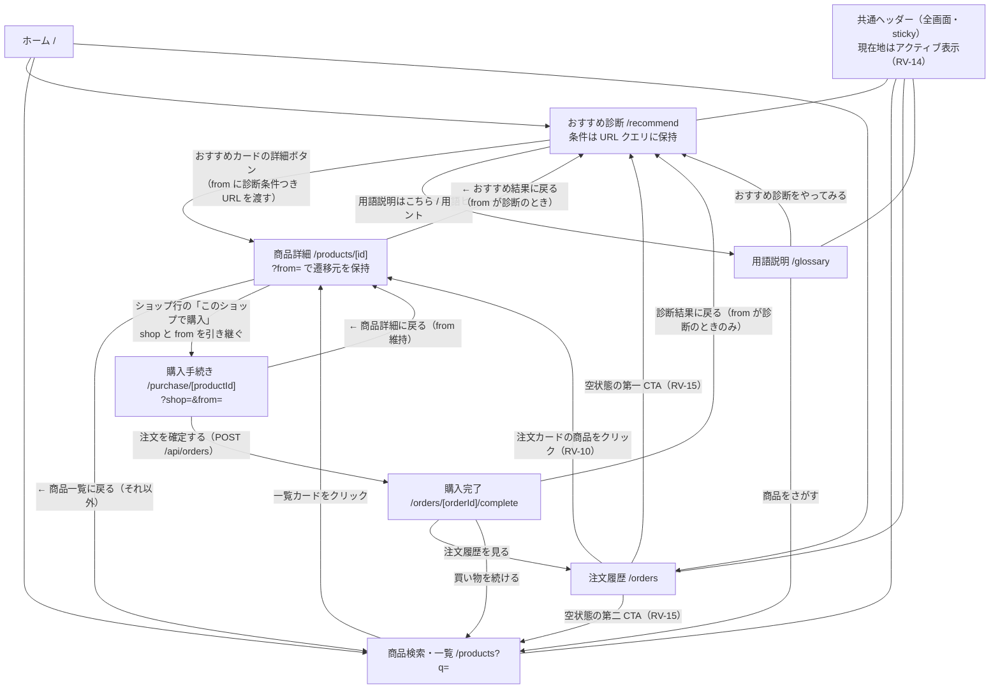

# 画面フロー設計 — プロテイン比較・購入アプリ

- 作成日: 2026-08-28
- 入力: `docs/02-prototype/ui-spec.md`（**確定版・必須入力**）、`docs/01-requirements/feature-list.md`（承認済み）、`docs/03-design/api-spec.md`
- 位置づけ: 開発フロー第3段階（詳細設計）の成果物。**`ui-spec.md` の画面構成・操作方法をそのまま踏襲する。**

## 1. フロントエンド技術選定（決定事項）

`ui-spec.md` §8・§9 で `/design` に委ねられた項目を決定する。

| 項目 | 決定 | 根拠 |
|------|------|------|
| フレームワーク | Next.js 16 App Router（既存）＋ React 19 | 既存構成を踏襲。URL に状態を持つ仕様（RV-02）とサーバー側描画の相性がよい |
| スタイル | Tailwind CSS v4（既存） | 既存構成を踏襲。`ui-spec.md` §1 のトーン（白基調＋エメラルド、余白の広いカード）を再現できている |
| UI コンポーネントライブラリ | **`shadcn/ui` を導入する**（＋ `class-variance-authority` / `tailwind-merge` / `clsx`） | **人間がレビューしやすいコード量にするため**（判断の経緯と計測結果は §1-2）。当初は「導入しない」と判断したが、プロトタイプのコードを計測した結果、同じスタイルの手書き重複が読みにくさの主因と判明したため決定を変更した |
| **アイコン** | **`lucide-react` を導入する** | `ui-spec.md` §8 が「線の太さ・サイズが統一されたアイコンセット」への置き換えを要求している。lucide は全アイコンが同一のストローク幅で設計され、`size` / `strokeWidth` を props で揃えられる。必要な十数個を自作 SVG で描くより、統一性の担保と保守が容易。ツリーシェイクされるためバンドルへの影響も限定的 |
| **フォント** | **`Noto Sans JP`（`next/font/google`、weight 400/500/700、`display: swap`）**。金額・数量の表示には `font-variant-numeric: tabular-nums` を当てる | ①`ui-spec.md` §8 でひな形既定の Arial からの変更が必須 ②日本語のかな・漢字を全ウェイトで正しく持ち、初心者向けアプリで最優先される可読性が高い ③価格を縦に並べて比較する画面（一覧・ショップ行）で桁がずれないよう等幅数字を使う。見出し用の別書体は導入せず、太さと大きさで階層を作る（読み込むフォントを増やさない） |
| 状態管理 | React の `useState` と **URL クエリ**（追加ライブラリなし） | 診断条件は URL に持つ仕様（RV-02）。それ以外に共有状態がない |
| アイコン絵文字の扱い | `ui-spec.md` §8 のとおり、UI 上の絵文字（🎯🔍📦 等）は **lucide のアイコンに置き換える**。お届け状況のバッジも同様（📝→ `ClipboardList` / 🚚→ `Truck` / 📬→ `PackageCheck`）。**色分けは `ui-spec.md` §5 の指定（グレー／青／緑）を維持する** | §8 の指示どおり |
| 商品画像 | `public/images/products/` に配置し、`next/image` で表示。**絵文字プレースホルダーは使わない**（`ui-spec.md` §8） | レイアウトシフトを防ぐため幅・高さを固定し、`sizes` を指定する |

### 1-1. ルーティング（デモからの変更）

デモは本番画面と衝突しないよう `/prototype/**` に置いていたが、**本実装はルート直下に置く。**
`src/app/prototype/` は捨てるコードなので、実装時に削除する（`ui-spec.md` 冒頭の方針）。

| 画面 | パス |
|------|------|
| ホーム | `/` |
| おすすめ診断 | `/recommend` |
| 商品検索・一覧 | `/products` |
| 商品詳細 | `/products/[id]` |
| 購入手続き | `/purchase/[productId]` |
| 購入完了 | `/orders/[orderId]/complete` |
| 注文履歴 | `/orders` |
| 用語説明 | `/glossary` |

**購入完了を独立した URL にした理由**（デモは購入画面内の状態切り替えだった）: 完了画面を注文 ID で参照できる URL にすると、サーバー側で注文を読んで描画できるためリロードしても内容が消えない。またブラウザバックは購入フォームに戻るだけで、再送信しても冪等キーで弾ける（RV-07）。**画面に表示する内容・操作は `ui-spec.md` §4 のまま**で、UX の変更ではない。

## 1-2. コンポーネント設計とレビューしやすさ（決定の経緯）

### 計測した問題

「UI コンポーネントライブラリを導入しない」という当初の判断に対し、レビューのしやすさを理由に再検討した。プロトタイプのコード（`src/app/prototype/`、9 ファイル・1,389 行）を計測した結果は次のとおり。

| 計測項目 | 結果 |
|---------|------|
| `className` 属性の総数 | **259 個**（クラス文字列だけで合計 12,546 文字） |
| `className` の平均長 | 48.4 文字。最長は 203 文字（おすすめカルーセルのカード） |
| **同じ「エメラルドの主ボタン」の手書き重複** | **6 ファイルに 12 箇所** |
| **同じ「カード枠」（`rounded-2xl border border-slate-200`）の重複** | **18 箇所** |
| 最も長い画面ファイル | `recommend/page.tsx` = **404 行** |

**読みにくさの主因は「ライブラリの不在」そのものではなく、共通部品を切り出していないことだった。** レビュアーは `<button className="w-full sm:w-auto px-8 py-3 rounded-xl bg-emerald-600 text-white font-bold disabled:bg-slate-300 hover:bg-emerald-700 transition">` という 139 文字を読んで初めて「これは主ボタンだ」と分かる。これが 12 箇所ある。

### 決定

**`shadcn/ui` を導入し、画面コードは「意味の分かる短い呼び出し」で書く。**

```tsx
// 導入前（139 文字のクラス文字列を読み解く必要がある）
<button className="w-full sm:w-auto px-8 py-3 rounded-xl bg-emerald-600 text-white font-bold disabled:bg-slate-300 hover:bg-emerald-700 transition" disabled={!purpose || !timing}>
  おすすめを見る
</button>

// 導入後（何をする要素かが一目で分かる）
<Button size="lg" disabled={!purpose || !timing}>おすすめを見る</Button>
```

選定理由:

1. **繰り返しレビューされる画面コードが短くなる。** 12 箇所のボタン定義と 18 箇所のカード枠が、それぞれ 1 つの部品定義に集約される
2. **`ui-spec.md` で約束したアクセシビリティの実装コードが減る。** キーボード操作・フォーカスリング・44px のタップ領域・`inert`（RV-06, RV-13, RV-14, RV-15）を手書きすると、まさにその分だけ画面ファイルが膨らむ。shadcn/ui は Radix UI の primitives を土台にしており、アコーディオン（お問い合わせ）・数量セレクトのキーボード操作と ARIA 属性が最初から入っている
3. **コードがリポジトリ内に生成される**（`npx shadcn@latest add button` で `src/components/ui/button.tsx` が作られる）。ブラックボックスの依存ではないので、レビューでき、エメラルドのトーンに合わせて自由に書き換えられる
4. **Tailwind CSS v4 と React 19 に対応済み**（公式ドキュメントで確認済み。`@theme inline` 方式・OKLCH のトークンに対応。既存の `globals.css` も `@theme inline` を使っているため素直に載る）
5. アイコンに選定した `lucide-react` は shadcn/ui の標準アイコンセットで、追加の選定が不要になる

### 正直に書いておくトレードオフ

- **リポジトリ全体の行数は増える。** 部品ファイル（1 つ 30〜80 行）が `src/components/ui/` に増えるため。**減るのは「繰り返し読む画面コード」の行数**であって、総行数ではない。レビューの負担は総行数ではなく「変更のたびに読む箇所」で決まるので、この交換は妥当と判断した
- **依存が増える**（Radix UI・CVA・tailwind-merge）。ただし Radix は使う primitive の分だけ入る
- ~~**`globals.css` のトークンを書き換える必要がある。**~~ → **解消した。** 当初は「shadcn/ui の既定色がエメラルドのトーンから外れるので `--primary` を上書きする必要がある」と書いていたが、`ui-spec.md` §11-3 で**配色をモノクロに変更した**ため、shadcn/ui の初期化で base color に **`Neutral`（無彩色）** を選べばトークンがそのまま仕様に一致する。上書きが不要になり、導入コストが下がった

### 導入する部品と使用箇所

`npx shadcn@latest add` で導入し、必要に応じてエメラルドのトーンに合わせて手を入れる。

| 部品 | 用途 | 使用画面 |
|------|------|---------|
| `Button` | 主ボタン・副ボタン・アイコンボタン（`variant` と `size` で切り替え） | 全画面 |
| `Card` | カード枠（`rounded-2xl border` の 18 箇所を集約） | ホーム・診断・一覧・詳細・購入・履歴・用語説明 |
| `Badge` | 種類バッジ・特徴バッジ・「最安」バッジ・**お届け状況バッジ**（状態ごとの色は `variant` で持つ） | 一覧・詳細・診断・履歴 |
| `Toggle` / `ToggleGroup` | **診断のピル型ボタン**（単一選択＝`ToggleGroup type="single"`、複数選択＝`type="multiple"`）。キーボード操作と `aria-pressed` が標準で付く | 診断 |
| `Accordion` | **お問い合わせ先の開閉**（同時に 1 件のみ＝`type="single" collapsible`）。ARIA とキーボード操作を Radix に任せる | 履歴 |
| `Select` | 数量選択（1〜5） | 購入 |
| `Alert` | モック注意バナー・ダミー決済の警告・条件変更の警告・不正リンクの通知 | 全画面・診断・購入 |
| `Carousel` | おすすめのカルーセル。**矢印・ドット・スワイプ・左右矢印キーの 4 操作**（RV-06, RV-15）が Embla Carousel 経由で標準提供される | 診断 |
| `Input` | 検索欄、ダミーのカード入力欄（`readOnly`） | 一覧・購入 |
| `Separator` / `Skeleton` | 区切り線、読み込み表示 | 各画面 |

**独自に作る部品**（ライブラリでは代替できない、このアプリ固有のもの）:

| 部品 | 責務 |
|------|------|
| `PriceWithShipping` | 価格 ＋ 送料の注記（`3,980円（内 送料 500円）`／`（送料無料）`／`（店頭価格・送料なし）`）。**`ui-spec.md` §6 の共通ルールを 1 箇所に閉じ込め、適用漏れを構造的に防ぐ** |
| `ShippingBreakdown` | ショップ行の内訳（`商品 3,480円 + 送料 500円`） |
| `DeliveryStatusBadge` | お届け状況のバッジ（ラベル・色・アイコンの対応を 1 箇所に持つ） |
| `RecommendationCard` | おすすめカードの構成（`ui-spec.md` §2 のカード構成 8 要素） |
| `ProductCard` | 一覧のカード |

> **`PriceWithShipping` を独自部品として切り出す理由**: 送料の明記漏れは実際に RV-16 → RV-18 と 2 回の指摘を招いた箇所である。表示ルールを 1 つの部品に閉じ込めれば、「一覧カードだけ書き忘れる」という漏れが起きなくなる。**レビューしやすさは、部品の粒度で仕様の守りやすさに直結する。**

### 画面ファイルの分割方針

ライブラリ導入と併せて、**1 ファイルの責務を絞る。** `recommend/page.tsx` が 404 行になった原因は、条件選択・カルーセル・状態復元・採点結果の表示がすべて 1 ファイルに入っていたことである。

- `page.tsx`（サーバーコンポーネント）… データ取得と組み立てのみ
- `_components/` … 画面固有のクライアントコンポーネント（例: `criteria-form.tsx`, `recommendation-carousel.tsx`）
- **目安として 1 ファイル 150 行以内**。超えたら分割を検討する

## 1-3. ダークモードの実装方式（`ui-spec.md` §11-1 の設計）

### 現状の問題

`src/app/globals.css` には ひな形由来の `@media (prefers-color-scheme: dark)` ブロックがあるが、**`dark:` 修飾子の使用は 0 箇所**で、色は直書きされている（`bg-white` 32・`text-slate-500` 38・`text-slate-600` 32・`border-slate-200` 22・`bg-slate-50` 6 箇所）。OS をダークにしても `bg-slate-50` 等が上書きするため**画面は明るいまま**で、ダークモードの宣言は死んだコードになっている。

### 方式: `dark:` を足すのではなく「意味のトークン」に置き換える

素朴に `bg-white dark:bg-slate-900` と書き分けると、**130 箇所以上でクラス文字列が倍になり、§1-2 で解決したはずの「読みにくさ」が戻る。** そこで色を意味で名付けたトークンに置き換え、**マークアップは 1 通りのまま**にする。

| 直書き（プロトタイプ） | 置き換え後のトークン | 意味 |
|--------------------|------------------|------|
| `bg-slate-50` | `bg-background` | ページ地色 |
| `bg-white` | `bg-card` | カード・パネルの面 |
| `text-slate-900` | `text-foreground` | 本文 |
| `text-slate-500` / `text-slate-600` | `text-muted-foreground` | 補助テキスト |
| `border-slate-200` | `border-border` | 装飾的な区切り線 |
| （入力欄の枠） | `border-input` | 入力欄の枠（**3:1 が必要**なので `border` とは別トークン） |
| `bg-emerald-600 text-white` | `bg-primary text-primary-foreground` | 主ボタン |
| `text-emerald-700` | `text-foreground` ＋下線 | リンク（モノクロでは色で示せないため下線で示す） |
| `bg-emerald-50 text-emerald-900` | `bg-muted text-foreground` | おすすめ理由・連絡先の面 |

> **配色はモノクロ（無彩色）**。`ui-spec.md` §11-3 で決定した。トークンの具体値と実測コントラストは同節の表を参照（`neutral` 系を使用）。プロトタイプのエメラルドグリーンは使わない。

この方式は **shadcn/ui が Tailwind v4 で採用しているトークン体系そのもの**なので、§1 のライブラリ導入と一体で進められる（別作業にならない）。

### 手順

1. **`dark` 変種をクラス方式に切り替える。** Tailwind v4 の既定は `prefers-color-scheme` のみで切替ボタンが作れないため、`globals.css` に次を書く（公式ドキュメントで確認済み）:

   ```css
   @import "tailwindcss";
   @custom-variant dark (&:where(.dark, .dark *));
   ```

2. **トークンを 2 セット定義する**（`:root` と `.dark`）。ひな形の `@media (prefers-color-scheme: dark)` ブロックは**削除する**（クラス方式と二重管理になるため）。
3. **`next-themes` でテーマを切り替える。** `ThemeProvider`（クライアントコンポーネント）を作り、`layout.tsx` の `<body>` 内で `children` を包む。渡す props は `attribute="class"` / `defaultTheme="system"` / `enableSystem` / `disableTransitionOnChange`。
4. **`<html>` に `suppressHydrationWarning` を付ける。** サーバー側ではテーマを確定できず、クライアントの描画と食い違って hydration 警告が出るため（公式の指示）。なお `lang="ja"`（RV-08①）はそのまま維持する。
5. **切替コントロールをヘッダー（メニューバー）に置く。** `ui-spec.md` §11-1 の決定どおり、**アイコンボタン 1 つでライト ⇄ ダークを切り替える**。**初期状態は OS 設定に従い**、利用者が一度クリックしたらその選択を記憶する（`next-themes` の `defaultTheme="system"` ＋ `setTheme("light"|"dark")`）。アイコンは現在のモードに応じて切り替え、`aria-label` を付ける。「タップ領域 44px」を満たすサイズにする。

### 配色の値

**モノクロ（無彩色）**。具体値と実測コントラストは `ui-spec.md` §11-3 の表が正（`neutral` 系を使用）。要点のみ再掲する。

- `foreground` / `primary` は明暗で反転する（ライト = `neutral-900`、ダーク = `neutral-50`）。**主ボタンのコントラストは 17.93:1 / 17.18:1** で AAA を大きく上回る
- `muted-foreground` はダークで 1 段明るくする（`neutral-500` → `neutral-400`）。`neutral-500` は暗い地で 3.78:1 と本文には不足するため
- **`input`（入力欄の枠）は明暗ともに `neutral-500`** で 3:1 以上を満たす（1 つの値で足りる）
- `border`（装飾的な区切り線）は低コントラストで可。**入力欄の枠と区切り線でトークンを分ける**のがこの配色の要点

> **`ui-spec.md` §11-2（緑ボタンのコントラスト未達）は、モノクロ化により緑ボタン自体が無くなったため解消した。**

### 個別に手当てする箇所

| 対象 | 扱い |
|------|------|
| **お届け状況バッジ**（`ui-spec.md` §5・§11-3） | 色相ではなく**塗りの強さ**で 3 段階を区別する（枠線のみ／淡い面／反転）。アイコンとラベルは常に併記。明暗どちらでも同じ「強さの順序」を保つ |
| **モック注意バナー・ダミー決済の警告**（琥珀色を失う） | **反転バー**（濃い面に明るい文字）＋警告アイコン＋太字。モノクロでは反転が最も強い強調になる |
| **エラー表示**（赤を失う） | 反転の面＋エラーアイコン＋太字。文言で理由と回復手段を明示する（`api-spec.md` §1-4） |
| **商品画像**（本実装では実写。**画面で唯一色を持つ要素**） | 明暗どちらでも浮かないよう薄い枠（`border-border`）を敷く。無彩色の UI に対して写真が際立つのが `ui-spec.md` §11-3 の設計意図 |
| **フォーカスリング**（RV-15 で約束） | `ring` トークンとして定義。ライト `neutral-900` / ダーク `neutral-50` で 17:1 以上 |
| 「送料無料」の強調（`ui-spec.md` §6） | 太字 ＋ 淡い面（`bg-muted`）のチップ。色替えはしない |

### 検証（`/implement` で必ず行う）

- **明暗の両方**で全 8 画面を目視確認する（`ui-spec.md` §11 の「視覚的な結果は `/implement` で確認する」）
- 本文・補助テキスト・ボタン文字・フォーカスリングのコントラストを**両モードで**測る
- OS 設定の切替に追従するか、リロードしてもテーマが保持されるか、初回描画で明→暗のちらつき（FOUC）が出ないかを確認する

## 2. 画面一覧

| 画面名 | パス | 目的 | 対応機能 |
|--------|------|------|---------|
| ホーム | `/` | 3 つの主導線（おすすめ診断・商品検索・注文履歴）への入口 | —（導線のみ） |
| おすすめ診断 | `/recommend` | 条件を選び、おすすめを順位・理由つきで 1 件ずつ見る | F-01, F-02 |
| 商品検索・一覧 | `/products` | 商品名・ブランド名で探し、価格と含有率を並べて見る | F-03 |
| 商品詳細 | `/products/[id]` | 成分・価格・販売場所（ネット通販／実店舗）を 1 か所で見る | F-04, F-05 |
| 購入手続き | `/purchase/[productId]` | ネット通販の商品をアプリ内で購入する（モック） | F-06 |
| 購入完了 | `/orders/[orderId]/complete` | 注文番号と要約を示し、次の行動へ導く | F-06, F-10 |
| 注文履歴 | `/orders` | 注文とお届け状況を確認し、販売店舗の連絡先を見る | F-07, F-08, F-10 |
| 用語説明 | `/glossary` | 初心者が用語・数値の意味でつまずかないようにする | F-02 の補助（RV-04） |

## 3. 画面遷移図



## 4. 共通レイアウト（`ui-spec.md` §1）

- **`<html lang="ja">`** とする（RV-08①）。`metadata` はひな形の「Create Next App」を使わず、アプリ名と説明を設定する（RV-14）
- **モックである旨・個人情報を入力させない旨の注意書きを最上部に常時表示**（バナー）
- **共通ヘッダー（sticky）**: アプリ名 ＋ ナビ 4 項目「おすすめ診断」「商品をさがす」「注文履歴」「用語説明」
  - **現在地のナビをアクティブ表示する**（色を変え、下線を引き、`aria-current="page"` を付ける）（RV-14）
  - ナビリンクは上下パディングでタップ領域を 44px 目安に確保する（RV-14, RV-15）
- トーン: 白基調 ＋ エメラルドグリーンをアクセント、余白の広いカード型
- 金額を表示する箇所は等幅数字（`tabular-nums`）にして桁を揃える

## 5. 各画面の構成要素と操作

### 5-1. ホーム `/`

- 見出しとリード文（初心者向けの価値を一言で示す）
- 3 枚のカード導線: 「おすすめ診断」（主導線・強調）／「商品をさがす」／「注文履歴」
- 操作: カードをクリックで各画面へ遷移

### 5-2. おすすめ診断 `/recommend`（F-01, F-02）

#### 画面上部: 条件選択（`ui-spec.md` §2）

| 質問 | 選択方式 | 選択肢 |
|------|---------|--------|
| 1. プロテインを飲む目的は？ | **必須・単一選択**（ピル型ボタン） | 筋肉をつけたい／ダイエット・減量／健康維持・栄養補給 |
| 2. 主に飲みたいタイミングは？ | **必須・単一選択**（ピル型ボタン） | 運動後／朝食時・朝／就寝前／間食・おやつ代わり |
| 3. こだわりはありますか？ | **任意・複数選択**（ピル型ボタン） | 乳糖不耐症対応／植物性（ヴィーガン対応）／低糖質／国内製造／価格の安さ重視 |

- 必須 2 問が未選択の間は「おすすめを見る」ボタンを**非活性**にする
- 質問 3 の下に「用語がわからないときは用語説明へ」のヒントリンクを置く（RV-15）

#### 操作と状態遷移

| 操作 | 挙動 |
|------|------|
| ピル型ボタンをクリック／タップ | 選択・解除（質問 1・2 は択一、質問 3 はトグル） |
| 「おすすめを見る」を押す | ①条件を URL クエリ（`?purpose=&timing=&prefs=`）に反映（履歴を汚さないよう `replace`）②結果を描画 ③**結果セクションへ自動スクロール**（RV-05） |
| URL に条件付きで直接アクセス／詳細から戻る | **URL クエリから条件と結果を復元する**（診断のやり直しを強制しない）（RV-02） |
| URL の条件が不正（存在しない目的・タイミング等） | **黙って無視せず**「リンクに含まれていた診断条件が無効だったため復元できませんでした。条件を選び直してください」と通知する（RV-15） |
| 結果表示後に条件を変更 | 古い結果を**グレーアウトし、クリック・キーボードフォーカスの両方で操作不可**にする（`pointer-events-none` と `inert`）。警告バナーに「新しい条件でおすすめを見る」再実行ボタンを置き、操作の出口をそちらに用意する（RV-05, RV-13, RV-15） |

#### 画面下部: おすすめ表示（カルーセル）

- **カード形式で 1 件ずつ表示**。最大 5 件、順位つき
- **移動手段は 3 つを併存させる**（RV-06）: ①左右の矢印ボタン ②ドットインジケーター ③**カードの左右スワイプ**
  - さらに**キーボードの左右矢印キー**で移動できる。カードはフォーカス可能にし、フォーカス時はフォーカスリングを表示する（RV-15）
  - ドットは見た目が小さくてもタップ領域を 44px 目安に確保する（RV-06, RV-14）
- 結果見出しの直下に**順位の根拠**を明記: 「順位は『選んだ条件との一致度』と『価格（1g あたり・総額）』の総合で決まります。カードの ✓ が一致した条件です」（RV-09）
- **結果の下に「用語説明はこちら」リンク**を置く（RV-04）
- 0 件のとき: 「条件に合う商品が見つかりませんでした。こだわり条件を減らして試してみてください」と回復策を示す

#### カードの構成（上から順・`ui-spec.md` §2）

1. 商品画像 ＋ 「おすすめ N 位」バッジ
2. ブランド
3. 商品名・フレーバー
4. **価格（最安値）**・1g あたり価格・タンパク質含有率
   - 価格の注記は「最安値・送料込み」ではなく**送料の金額を明記**する（RV-18①）: `3,980円（内 送料 500円）` ／ 送料 0 円なら `（送料無料）` ／ 最安が実店舗なら `（店頭価格・送料なし）`
5. **送料の内訳の下に「最安値: ショップ名」**を添え、どこの価格かを示す（RV-18①）
6. **✓ 一致した条件のチップ**（一致した目的・タイミング・こだわりのラベル）（RV-09）
7. 1 行のおすすめ理由（`api-spec.md` §4-2 の規則で生成）（RV-09）
8. 「詳細・購入方法を見る」ボタン → 商品詳細へ（`from` に**診断条件つきの URL** を渡す）（RV-02）

### 5-3. 商品検索・一覧 `/products`（F-03）

- 検索入力欄（`q` を URL クエリに反映）。**商品名・ブランド名・味・種類の部分一致**
- 件数表示（「12 件」）
- 一覧カード（グリッド）: 商品画像・種類バッジ・ブランド・商品名＋フレーバー・**最安値〜**・1g あたり価格・タンパク質含有率・**送料の注記**（`内 送料 500円` 等）（RV-18①）
- 0 件のとき: 「『{検索語}』に一致する商品が見つかりませんでした」と**検索語を引用**して示す
- 操作: カードをクリックで商品詳細へ（`from` は付けない → 詳細の戻り先は一覧になる）
- **絞り込み UI は作らない**（要件スコープ外 #5）

### 5-4. 商品詳細 `/products/[id]`（F-04, F-05）

#### 構成（`ui-spec.md` §3）

1. **戻り導線**: `from` が診断条件つき URL なら「← おすすめ結果に戻る」、それ以外は「← 商品一覧に戻る」（RV-02）
   - `from` は**自サイト内の `/recommend` で始まるパスのみ許可**する（外部 URL へのオープンリダイレクトを防ぐ）
2. 商品サマリー: 画像・ブランド・商品名＋フレーバー・説明・種類バッジ・特徴バッジ
3. **スペック 4 点**: 最安値（**送料の注記つき** `3,980円（内 送料 500円）`。RV-18①）／1g あたり価格／タンパク質含有率／内容量
4. **ネット通販で買う**: ショップ行の一覧
   - **総額の安い順に並べ、先頭（最安）に「最安」バッジを付ける**（RV-11）
   - 各行: ショップ名（＋最安バッジ）・1g あたり価格・**総額**・その下に**内訳** `商品 3,480円 + 送料 500円`（送料 0 円なら「送料無料」を色を変えて表示）（RV-16, RV-18②）
   - 各行に「このショップで購入」ボタン → 購入手続きへ（`shop` と `from` を引き継ぐ）（RV-12）
   - 注記: 「表示価格はすべて送料込みで、各行に内訳（商品代金 + 送料）を記載しています。デモのため購入はモックで、実際の決済・注文は発生しません」
5. **実店舗で買う**: 店舗カードの一覧（店頭価格・アクセス・電話・営業時間）
   - 各店舗に「店頭でのお渡しのため送料はかかりません」を明記（`ui-spec.md` §6）
   - 0 件のとき: 「この商品を取り扱っている実店舗のデータはありません」を表示

### 5-5. 購入手続き `/purchase/[productId]`（F-06）

#### 構成（`ui-spec.md` §4）

1. 戻り導線「← 商品詳細に戻る」（**`from` を維持したまま戻る**）（RV-12）
2. **ダミーである旨の警告**: 「これはダミーの購入画面です。実際の支払いは発生しません。実在のカード番号・氏名などの個人情報は入力しないでください」
3. **注文内容**: 商品画像・ブランド・商品名＋フレーバー・ショップ名・総額・**数量選択（1〜5）**
4. **合計の内訳（3 行）**（RV-16）:
   | 行 | 内容 |
   |----|------|
   | 商品代金（単価 × 数量） | `3,480円 × 2` → `6,960円` |
   | 送料 | `500円`（0 円なら「無料」を強調色で） |
   | **合計** | `7,460円` |

   > **送料は注文単位で 1 回**（数量では乗じない）。`questions.md` Q-01 で確定（toby 判断・2026-08-28）。数量を変えても送料行の金額は変わらない。
5. **お支払い方法（ダミー）**: クレジットカード／コンビニ払い／銀行振込 のピル選択
   - クレジットカードを選んだときのみカード欄を表示（段階的開示）
   - **カード番号・名義・有効期限の入力欄は `readOnly`（編集不可）**にする。実在のカード情報を入力できないようにする（RV-08③）
   - **「ダミー値をランダム生成」ボタン**でダミー値を差し替えられる（RV-08③）
   - 「入力欄は編集できません（実在のカード情報を入力させないため）」の注記を添える
6. **「注文を確定する（ダミー決済）」ボタン**（幅いっぱい・大きめ）
   - **確認ステップは挟まない**（この画面で注文内容を確認できるため。RV-03 の見送り判断を踏襲）

#### 操作とガード（RV-07）

| 操作・状況 | 挙動 |
|-----------|------|
| 画面表示時 | クライアントで `idempotencyKey`（UUID）を 1 つ生成して保持する |
| `shop` パラメータがその商品を扱っていない／不正 | **先頭ショップにフォールバックしない。** 購入フォームを表示せず「指定された販売ショップではこの商品を購入できません。商品詳細から選び直してください」とエラーと戻り導線を表示する |
| 「注文を確定する」を押す | `POST /api/orders` を呼ぶ。**送信中はボタンを無効化し、ラベルを「処理中…」にする**（多重クリック防止） |
| 送信が失敗した | エラーメッセージを画面上に表示し、**入力内容（数量・支払い方法）は保持**したまま再試行できるようにする |
| 成功した | `/orders/[orderId]/complete`（`from` を引き継ぐ）へ遷移する |
| 完了後にブラウザバック → 再度確定 | 同じ `idempotencyKey` なので**新しい注文は作られず**、既存の注文の完了画面に戻る（`api-spec.md` §5 の #7） |

### 5-6. 購入完了 `/orders/[orderId]/complete`（F-06, F-10）

- 成功アイコンと「ご注文が完了しました（モック）」
- 要約: 注文番号・商品名（フレーバー）× 数量・ショップ名・支払い方法（ダミー）・合計・**お届け状況「注文済み」**（RV-17）
- 注記: 「実際の決済・配送は行われません。注文はこのデモ内にのみ記録されています」
- 次アクション: 「注文履歴を見る」／**（`from` が診断のときのみ）「診断結果に戻る」**（RV-12）／「買い物を続ける」

### 5-7. 注文履歴 `/orders`（F-07, F-08, F-10）

- 見出しとリード文（「注文した商品と、お届け状況の一覧です」）
- 注文カード（**`orderedAt` の降順**）
  - 上段: 注文番号・注文日時
  - **商品名の上に「お届け状況」のバッジ**を置く。**ブランドは表示しない**（RV-17。ブランドは商品詳細で確認できる）
    | 状態 | ラベル | 色 | アイコン |
    |------|-------|----|---------|
    | `ordered` | 注文済み | グレー | `ClipboardList` |
    | `shipping` | お届け中 | 青 | `Truck` |
    | `delivered` | お届け済み | 緑 | `PackageCheck` |
  - 商品画像・商品名＋フレーバー・ショップ名・`単価 × 数量 = 合計`（**記号は半角**。RV-18②）・支払い方法
  - **商品部分全体がクリック可能**で、商品詳細へ遷移する。「商品詳細を見る →」の明示リンクを添える（RV-10）
  - 「お問い合わせ」ボタン: 押すと販売ショップの連絡先（メール・電話）を**アコーディオンで開く。同時に開くのは 1 件のみ**。ボタンのラベルは開いている間「閉じる」に変わる。注記「デモのため表示のみです。実際のメール送信・発信は行いません」（F-08）
- 注文が 0 件のとき: 空状態メッセージ ＋ **第一 CTA「おすすめ診断で選ぶ」・第二 CTA「商品をさがす」**（RV-15）
- **お届け状況を利用者が進める操作は置かない**（`ui-spec.md` §5・§8）。デモにあった「デモ用: お届け状況を次に進める」リンクは作らない

### 5-8. 用語説明 `/glossary`（RV-04）

- 見出し「用語説明」＋ リード文
- **プロテインの種類 5 つ**（ホエイ／WPI／カゼイン／ソイ／ミックス）: それぞれ 1〜2 行の説明 ＋ 「こんな人に」の一言
- **数値の見方**: タンパク質含有率の目安（65〜75% が一般的・85% 以上は高純度）／1g あたり価格の目安（送料込み）
- **乳糖不耐症**の説明と、対応する種類（WPI・ソイ）・診断での絞り込み方法
- 医学的助言ではない旨の注記
- **ページ末尾に「おすすめ診断をやってみる」「商品をさがす」への導線**を置き、読んだ後に行動へ戻す
- 導線（この画面に来る経路）: ①ヘッダーナビの「用語説明」 ②おすすめ診断の結果下のリンク ③診断のこだわり質問の下のヒントリンク

## 6. データ取得の方式（画面ごと）

`api-spec.md` §1-1 の方針に従う。

| 画面 | 取得方法 |
|------|---------|
| 一覧・詳細・診断結果・注文履歴・完了・用語説明 | **サーバーコンポーネントからサービス層を直接呼ぶ**（HTTP を経由しない）。URL クエリが変わればページが再描画される |
| 購入の確定 | **クライアントから `POST /api/orders`** を `fetch` で呼ぶ |
| 診断のピル操作・カルーセル・アコーディオン | クライアントコンポーネント（`useState`）。サーバーへの問い合わせは発生しない |

`searchParams` と動的セグメントの `params` は Next.js 15 以降 Promise なので `await` して使う（`api-spec.md` §1-5）。

## 7. 機能と画面の対応（トレーサビリティ）

| 機能ID | 機能名 | 対応画面 |
|--------|--------|---------|
| F-01 | おすすめ条件の選択 | おすすめ診断（上部の 3 質問） |
| F-02 | おすすめ商品の提示 | おすすめ診断（下部のカルーセル）＋ 用語説明（補助） |
| F-03 | 商品検索 | 商品検索・一覧 |
| F-04 | 商品情報の一気見 | 商品詳細（サマリー・スペック 4 点・ネット通販） |
| F-05 | 実店舗情報の表示 | 商品詳細（実店舗で買う） |
| F-06 | 購入手続き | 購入手続き ＋ 購入完了 |
| F-07 | 注文履歴の表示 | 注文履歴 |
| F-08 | お問い合わせ先の表示 | 注文履歴（お問い合わせアコーディオン） |
| F-09 | サンプル商品データの整備 | 全画面の表示データ（シード。`db-design.md` §8） |
| F-10 | お届け状況の表示 | 注文履歴（状況バッジ）＋ 購入完了（注文済み） |

**すべての機能が画面でカバーされている。**

## UI/UX 仕様（ui-spec.md）の反映状況

`ui-spec.md` の全項目を節ごとに列挙し、設計での反映先を示す。RV-xx が付いていない項目も全件記載する。

### §1 全体・共通

| 項目ID | 指摘ID | UI/UX 仕様の内容 | 設計での反映先 | 状態 |
|--------|--------|----------------|--------------|------|
| §1-1 | — | 7 画面構成（ホーム／診断／一覧／詳細／購入／履歴／用語説明） | 「画面一覧」§2（購入完了を独立 URL にしたため 8 URL） | 踏襲 |
| §1-2 | RV-14 | 共通ヘッダー 4 ナビ・sticky・現在地のアクティブ表示 | 「共通レイアウト」§4 | 踏襲 |
| §1-3 | — | モック・個人情報を入力させない旨のバナーを常時表示 | 「共通レイアウト」§4 | 踏襲 |
| §1-4 | RV-08①, RV-14 | `<html lang="ja">`、metadata をひな形のままにしない | 「共通レイアウト」§4 | 踏襲 |
| §1-5 | — | トーン（白基調＋エメラルド、余白の広いカード型） | 「共通レイアウト」§4、技術選定 §1（Tailwind 継続） | 踏襲 |
| §1-6 | RV-14, RV-15 | タップ対象は 44px 目安のタップ領域 | 「共通レイアウト」§4、診断のドット §5-2 | 踏襲 |

### §2 おすすめ診断

| 項目ID | 指摘ID | UI/UX 仕様の内容 | 設計での反映先 | 状態 |
|--------|--------|----------------|--------------|------|
| §2-1 | — | 3 質問。目的・タイミングは必須単一、こだわりは任意複数、ピル型 | §5-2「条件選択」の表 | 踏襲 |
| §2-2 | — | 必須未選択の間は「おすすめを見る」を非活性 | §5-2「条件選択」 | 踏襲 |
| §2-3 | RV-06 | カルーセルで 1 件ずつ。矢印・ドット・スワイプの 3 手段を併存 | §5-2「おすすめ表示」 | 踏襲 |
| §2-4 | RV-06, RV-14 | ドット等の小さな要素もタップ領域 44px | §5-2「おすすめ表示」 | 踏襲 |
| §2-5 | RV-09, RV-18① | カードの構成順序（画像＋順位バッジ→ブランド→商品名→価格系→送料内訳→✓チップ→理由→詳細ボタン） | §5-2「カードの構成」1〜8 | 踏襲 |
| §2-6 | RV-18① | 価格注記は送料の金額を明記（`内 送料 500円`／`送料無料`／`店頭価格・送料なし`）＋「最安値: ショップ名」 | §5-2「カードの構成」4・5、`api-spec.md` §2（`shippingNote`）・§4（`cheapestShopName`） | 踏襲 |
| §2-7 | RV-09 | 結果見出し直下に順位付けの根拠の説明文 | §5-2「おすすめ表示」 | 踏襲 |
| §2-8 | RV-04 | 結果の下に「用語説明はこちら」リンク | §5-2「おすすめ表示」、遷移図 | 踏襲 |
| §2-9 | — | 最大 5 件・順位つき。0 件時は「こだわりを減らして」と回復策 | §5-2「おすすめ表示」、`api-spec.md` §4（手順5・0 件レスポンス） | 踏襲 |
| §2-10 | RV-02 | 診断条件を URL クエリに保持し、詳細から戻ったら復元 | §5-2「操作と状態遷移」、`api-spec.md` §4 のクエリ設計 | 踏襲 |
| §2-11 | RV-05 | 実行後は結果セクションへ自動スクロール | §5-2「操作と状態遷移」 | 踏襲 |
| §2-12 | RV-05, RV-13, RV-15 | 条件変更で古い結果をグレーアウトし操作不可（キーボード含む）、バナー側に再実行ボタン | §5-2「操作と状態遷移」 | 踏襲 |
| §2-13 | RV-15 | カルーセルは左右矢印キーでも移動。フォーカスリング表示 | §5-2「おすすめ表示」 | 踏襲 |
| §2-14 | RV-15 | 不正な条件付きリンクは黙って無視せず通知 | §5-2「操作と状態遷移」、`api-spec.md` §4（400 を返す） | 踏襲 |
| §2-15 | RV-15 | こだわり質問の下に用語説明へのヒントリンク | §5-2「条件選択」 | 踏襲 |
| §2-16 | RV-09 | 「価格の安さ重視」はタグではなく実際の価格で総合評価。理由文に総額を明記 | `api-spec.md` §4-1 手順2-d、§4-2 の理由文表 | 踏襲 |
| §2-17 | — | 乳糖不耐症対応を選んだら非対応商品を除外（ハードフィルタ） | `api-spec.md` §4-1 手順1 | 踏襲 |
| §2-18 | — | 採点の計算方式（外部 AI API／ローカル計算）は `/design` で決定 | `api-spec.md` §4-1（**ローカルのルールベースに決定**。根拠 4 点を記載） | 決定済み |

### §3 商品検索・商品詳細

| 項目ID | 指摘ID | UI/UX 仕様の内容 | 設計での反映先 | 状態 |
|--------|--------|----------------|--------------|------|
| §3-1 | — | 商品名・ブランド名等の部分一致検索。0 件時は検索語を引用 | §5-3、`api-spec.md` §2（`q`・`query` を返す） | 踏襲 |
| §3-2 | — | 一覧カードの項目（写真・種類バッジ・ブランド・商品名・価格〜・1g あたり・含有率） | §5-3（送料注記を追加。§6-2 の適用箇所指定による） | 踏襲 |
| §3-3 | — | 商品詳細の構成（サマリー＋スペック 4 点 → ネット通販 → 実店舗。実店舗 0 件時はその旨表示） | §5-4 の 2〜5 | 踏襲 |
| §3-4 | RV-11 | ネット通販は価格の安い順、最安に「最安」バッジ | §5-4 の 4、`api-spec.md` §3（`isCheapest`・昇順） | 踏襲 |
| §3-5 | RV-02 | 戻り導線を遷移元で切り替える（診断経由なら「おすすめ結果に戻る」） | §5-4 の 1（`from` の検証ルールを追加） | 踏襲 |

### §4 購入手続き

| 項目ID | 指摘ID | UI/UX 仕様の内容 | 設計での反映先 | 状態 |
|--------|--------|----------------|--------------|------|
| §4-1 | — | 構成（警告→注文内容→支払い方法→確定→完了）。数量 1〜5、合計は送料込み | §5-5 の 1〜6、§5-6、`db-design.md` §5-7（数量の CHECK 制約） | 踏襲 |
| §4-2 | RV-08③ | カード欄は `readOnly`（実在情報を入力できない） | §5-5 の 5、`api-spec.md` §5（**カード情報を API で受け取らない**構造で強化） | 踏襲 |
| §4-3 | RV-08③ | 「ダミー値をランダム生成」ボタン | §5-5 の 5 | 踏襲 |
| §4-4 | RV-12 | `from` を購入フローまで引き回し、完了画面に「診断結果に戻る」 | §5-5 の 1・操作表、§5-6 | 踏襲 |
| §4-5 | RV-03 | 確認ステップは追加しない | §5-5 の 6 | 踏襲（見送り判断を維持） |
| §4-6 | RV-07 | 不正パラメータの拒否・二重送信防止は `/design` で設計 | `api-spec.md` §5 バリデーション #6・#7、§9、§5-5 操作表 | 決定済み |

### §5 注文履歴・お問い合わせ

| 項目ID | 指摘ID | UI/UX 仕様の内容 | 設計での反映先 | 状態 |
|--------|--------|----------------|--------------|------|
| §5-1 | — | 注文カードの項目（注文番号・日時・状況・商品・ショップ・単価×数量=合計・支払い方法） | §5-7、`api-spec.md` §6 | 踏襲 |
| §5-2 | RV-17 | お届け状況は 3 段階（注文済み／お届け中／お届け済み） | §5-7 の表、`db-design.md` §4（ENUM） | 踏襲 |
| §5-3 | RV-17 | 商品名の上はブランドではなくお届け状況 | §5-7（「ブランドは表示しない」と明記） | 踏襲 |
| §5-4 | RV-17 | 状態ごとに色とアイコンを変えたバッジ（グレー／青／緑） | §5-7 の表（絵文字は §8-2 に従い lucide アイコンに置換。**色分けは維持**） | 踏襲（アイコンの実現手段のみ §8-2 で変更） |
| §5-5 | RV-17 | 注文直後は「注文済み」。完了画面にも表示 | §5-6、`api-spec.md` §5（`deliveryStatus: ordered` で作成） | 踏襲 |
| §5-6 | — | 状況の更新方法は `/design` で設計。**利用者が進める画面は作らない** | `db-design.md` §2-2、`api-spec.md` §7（管理用 API のみ・UI なし） | 決定済み |
| §5-7 | RV-10 | 注文カードの商品部分クリックで商品詳細へ（「商品詳細を見る →」つき） | §5-7、`api-spec.md` §6（`productId` を返す） | 踏襲 |
| §5-8 | — | お問い合わせは連絡先のアコーディオン表示（同時に 1 件のみ）。送信・発信はしない | §5-7 | 踏襲 |
| §5-9 | RV-15 | 空状態の第一 CTA は「おすすめ診断」、第二 CTA は「商品をさがす」 | §5-7、遷移図 | 踏襲 |

### §6 価格表示ルール

| 項目ID | 指摘ID | UI/UX 仕様の内容 | 設計での反映先 | 状態 |
|--------|--------|----------------|--------------|------|
| §6-1 | RV-01 | 表示価格は送料込みに統一し、その旨を明記 | `db-design.md` §7（総額の計算）、§5-3・§5-4・§5-5 の注記 | 踏襲 |
| §6-2 | RV-16, RV-18① | 送料の金額を必ず明記（3 形式）。適用箇所はおすすめカード・一覧カード・詳細のスペック欄 | `api-spec.md` §2・§3（`shippingNote`）、§5-2 の 4、§5-3、§5-4 の 3 | 踏襲 |
| §6-3 | RV-16 | 詳細のショップ行に `商品 3,480円 + 送料 500円`（0 円は「送料無料」を色替え） | §5-4 の 4、`api-spec.md` §3（`breakdownLabel`） | 踏襲 |
| §6-4 | RV-16 | 購入画面の合計は「商品代金／送料／合計」の 3 行 | §5-5 の 4 | 踏襲 |
| §6-5 | — | 実店舗の欄に「店頭でのお渡しのため送料はかかりません」 | §5-4 の 5 | 踏襲 |
| §6-6 | — | 送料はショップごとに決まる値として持つ | `db-design.md` §5-3（`shops.shipping_fee`） | 踏襲 |
| §6-7 | — | 価格には常に 1g あたり価格を併記 | §5-2 の 4、§5-3、§5-4 の 3・4、`api-spec.md` §2・§3 | 踏襲 |
| §6-8 | — | 「最安値」は全販売チャネルの最低価格（送料込み） | `db-design.md` §7 の定義表 | 踏襲 |
| §6-9 | RV-18② | 金額・数量の式の記号は半角。日本語の語をつなぐ用法は全角でよい | §5-4 の 4、§5-7、`api-spec.md` §3（`breakdownLabel` は半角 `+`） | 踏襲 |

### §8 踏襲しなくてよい部分（デモの割り切り）

| 項目ID | 指摘ID | UI/UX 仕様の内容 | 設計での反映先 | 状態 |
|--------|--------|----------------|--------------|------|
| §8-1 | RV-08② | 商品写真の絵文字プレースホルダー → 実画像に置換 | 技術選定 §1（`next/image`・`public/images/products/`）、`db-design.md` §5-1（`image_url`） | 対応（置換） |
| §8-2 | RV-08② | UI の絵文字アイコン → 統一されたアイコンセットに置換。**実現手段は `/design` で決定** | 技術選定 §1（**`lucide-react` に決定**）、§5-7（状況バッジのアイコン対応） | 決定済み |
| §8-3 | — | 注文のメモリ保存 → データベースに保存 | `db-design.md` 全体（`orders` テーブル・PostgreSQL・`docker-compose.yml` への `db` 追加） | 対応（置換） |
| §8-4 | — | 「デモ用: お届け状況を次に進める」リンクは**本実装では作らない** | §5-7（明記）、`api-spec.md` §7（管理用 API のみ） | 対応（作らない） |
| §8-5 | — | バリデーション・エラー処理・ローディング表示の作り込み | `api-spec.md` §1-4（エラー形式）・§5（バリデーション表）、§5-5 の操作表（送信中・失敗時） | 対応（本実装で作り込む） |
| §8-6 | — | フォント（ひな形の Arial） → 本実装で選定 | 技術選定 §1（**Noto Sans JP に決定**、金額は等幅数字） | 決定済み |

### §10 用語説明ページ

| 項目ID | 指摘ID | UI/UX 仕様の内容 | 設計での反映先 | 状態 |
|--------|--------|----------------|--------------|------|
| §10-1 | RV-04 | 初心者が用語・数値で置き去りにならないための独立ページ | §5-8、画面一覧 §2 | 踏襲 |
| §10-2 | RV-04 | 導線は①ヘッダーナビ ②おすすめ結果下のリンク | §4（ナビ 4 項目）、§5-2、§5-8、遷移図 | 踏襲（③診断のヒントリンク〈RV-15〉も追加済み） |
| §10-3 | RV-04 | 内容（種類 5 つ＋こんな人に／数値の見方／乳糖不耐症／医学的助言でない注記） | §5-8 | 踏襲 |
| §10-4 | RV-04 | 末尾に「おすすめ診断をやってみる」「商品をさがす」の導線 | §5-8、遷移図 | 踏襲 |

### 反映状況のまとめ

- **`ui-spec.md` の全 63 項目すべてを設計に反映した**（内訳: §1 が 6・§2 が 18・§3 が 5・§4 が 6・§5 が 9・§6 が 9・§8 が 6・§10 が 4）。
- **意図的に変更した UI/UX はない**（「状態」列に「変更」はひとつもない）。
- `ui-spec.md` §9 で `/design` に委ねられていた項目は、すべて本設計で決定し根拠を記録した。

| 委ねられた判断 | 決定 | 記載場所 |
|--------------|------|---------|
| おすすめ計算の実現方式 | ローカルのルールベース（外部 AI API・スクレイピングを使わない） | `api-spec.md` §4-1 |
| RV-07 のガード（不正パラメータ・二重送信） | ショップ×商品の整合性検証で 422、冪等キーで二重送信防止 | `api-spec.md` §5・§9 |
| 同名商品の味違いの扱い | 味ごとに 1 レコード。将来用に `product_group_key` のみ用意 | `db-design.md` §2-1 |
| アイコンの実現手段 | `lucide-react` を導入（shadcn/ui の標準アイコンセット） | 本書 §1 |
| フォント選定 | Noto Sans JP（金額は等幅数字） | 本書 §1 |

**`ui-spec.md` §9 に無い追加の設計判断**（レビュー後にご指摘を受けて決定）:

| 判断 | 決定 | 記載場所 |
|------|------|---------|
| UI コンポーネントライブラリ | **`shadcn/ui` を導入**（当初「導入しない」から変更）。理由はレビューのしやすさ。あわせてアプリ固有部品の切り出しと画面ファイルの分割方針を定めた | 本書 §1・**§1-2** |
| 送料の課金単位 | **注文単位で 1 回**（`questions.md` Q-01） | `db-design.md` §5-7・§7、`api-spec.md` §5、本書 §5-5 |
| 注文の保存方式・お届け状況の更新 | PostgreSQL の `orders` テーブル。更新は管理用 API のみ（UI なし）、一方向遷移 | `db-design.md` §2-2・§5-7、`api-spec.md` §7 |

- **未確定として残した論点は 1 件のみ**: プロトタイプのコードをリファクタするかどうか（`questions.md` Q-02）。**設計内容そのものには影響しない**（作業範囲の判断のみ）。
- 実装上の都合で URL 構成のみ変更した（購入完了を独立 URL に）。**画面に表示する内容・操作は `ui-spec.md` のまま**で、リロード耐性と二重送信防止（RV-07）が改善される。理由は §1-1 に記載。
